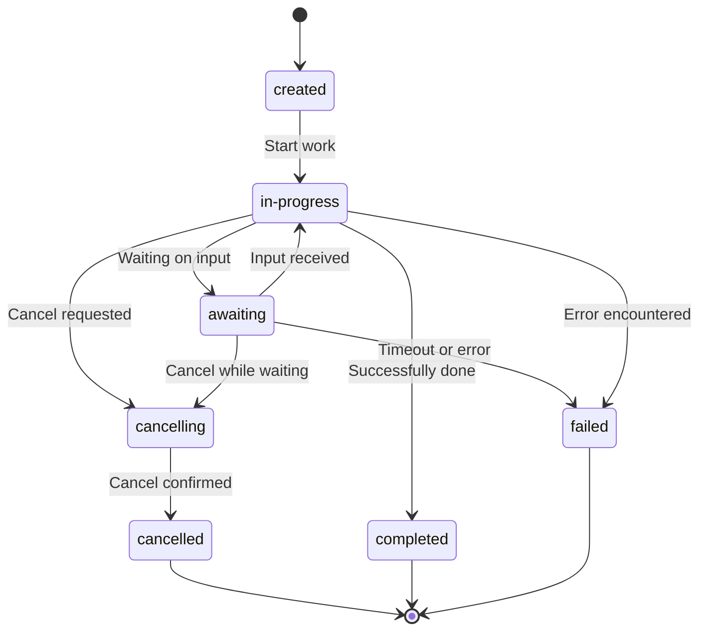

The Agent Communication Protocol (ACP) defines a structured lifecycle for individual agent runs that guides them from creation through completion. Understanding this run lifecycle is key to effectively managing agent executions and handling the different states runs transition through.

## Agent Run Lifecycle

Individual agent executions are managed through "Agent Runs," which can be part of a session and inherit its history. Each run follows a specific state machine that determines how it progresses from creation to completion.

### Run States

Agent Runs transition through the following states:



### State Descriptions

- **`created`** - The run has been initiated but not yet started processing
- **`in-progress`** - The agent is actively processing the request
- **`awaiting`** - The agent has paused execution and is waiting for additional input
- **`completed`** - The agent has successfully finished processing
- **`cancelling`** - A cancellation request has been received and is being processed
- **`cancelled`** - The run has been successfully cancelled
- **`failed`** - The run encountered an error and cannot continue

### State Transitions

Each run begins in the `created` state and transitions to `in-progress` after receiving input. While in progress, it can:

- Enter the `awaiting` state when requiring external input
- Complete successfully and enter the `completed` state
- Be cancelled and enter `cancelling` followed by `cancelled`
- Encounter an error and enter the `failed` state

Some agent implementations may allow continuing from certain terminal states back to `in-progress`.

## Managing Agent Runs

ACP provides specific API endpoints for managing the run lifecycle:

| **Method**               | **Endpoint**                  | **Description**                                                                                         |
|--------------------------|-------------------------------|---------------------------------------------------------------------------------------------------------|
| `POST`                   | `/runs`                       | Initiates a new agent run. Requires `agent_name`, `input`. Optional: `session_id`, `mode` (`sync`, `async`, `stream`). Returns the initial `Run` object or stream. |
| `GET`                    | `/runs/{run_id}`              | Retrieves the current state and details of a specific agent run.                                       |
| `POST`                   | `/runs/{run_id}`              | Resumes an agent run in the `awaiting` state. Requires `await_resume` data. Optional: `mode` for the response. |
| `POST`                   | `/runs/{run_id}/cancel`       | Requests cancellation of an ongoing agent run. Returns `202 Accepted` if cancellation is initiated.    |

## Execution Patterns

The ACP SDK supports several execution patterns that interact with the run lifecycle:

### Synchronous Execution

The client's `run_sync` method executes an agent and waits for the complete response:

```python
run = await client.run_sync(agent="echo", input=[Message(parts=[MessagePart(content="Howdy!")])])
```

### Streaming Execution

The `run_stream` method delivers incremental updates as the agent processes:

```python
async for event in client.run_stream(agent="echo", input=[Message(parts=[MessagePart(content="Howdy!")])]):
    print(event)
```

## State Persistence

Runs can maintain state across interactions in two ways:

### Multi-turn (sessions)

State can be preserved across multiple agent runs using sessions. The client can create a session to ensure the agent is maintaining the internal state between runs, and thus holding a continuous conversation.

When using the ACP SDK, the `input` argument will contain the full session history from all the previous runs in the same session. `context.session_id` holds the session id, allowing agents to store additional session-related data.

```python multi_turn.py
@server.agent()
async def multi_turn(input: list[Message], context: Context) -> AsyncGenerator[RunYield, RunYieldResume]:
    ... # `input` has the full history, `context.session_id` can be used to reference extra data
```

Client usage:

```python session.py
async with Client(base_url="http://localhost:8000") as client, client.session() as session:
    # First interaction
    run = await session.run_sync(agent="echo", input=[Message(parts=[MessagePart(content="Howdy!")])])
    # Second interaction in same session
    run = await session.run_sync(agent="echo", input=[Message(parts=[MessagePart(content="Howdy again!")])])
```

### Single-turn (await)

The await pattern pauses and resumes interaction within a single run to request additional information:

```python awaiting.py
@server.agent()
async def awaiting(input: list[Message], context: Context) -> AsyncGenerator[RunYield, RunYieldResume]:
    """Greets and awaits for more data"""
    yield MessagePart(content="Hello!")
    
    # Pause execution and request specific information
    resume = yield MessageAwaitRequest(
        message=Message(parts=[MessagePart(content="Can you provide me with additional configuration?")])
    )
    
    # Resume with the new information
    assert isinstance(resume, MessageAwaitResume)
    yield MessagePart(content=f"Thanks for config: {resume.message}")
```

This pattern allows the agent to begin processing with initial input, pause execution when it requires additional information, request that information, and resume from where it left off once the input is provided -- all within one single execution.
