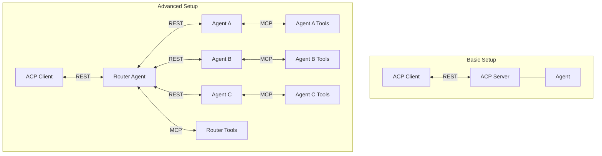

The **Agent Communication Protocol (ACP)** is designed to enable scalable, flexible communication between clients and agents, as well as among agents themselves. It supports everything from straightforward single-agent deployments to sophisticated multi-agent systems.

## Basic Setup

In the simplest form, ACP connects a client to a single agent through a REST interface. This is ideal for:
- Direct client-to-agent communication
- Lightweight deployments
- Debugging or testing individual agent behavior

Here, the ACP Server acts as a lightweight wrapper around the agent, converting REST calls into internal agent logic.

## Advanced Multi-Agent Setup

ACP also supports complex multi-agent architectures that enable advanced orchestration, specialization, and delegation. A common pattern is the **Router Agent** model, where:
- The Router Agent functions both as a **server** (handling requests from clients or upstream agents) and as a **client** (communicating with downstream agents).
- It decomposes incoming client requests into smaller sub-tasks.
- Routes these sub-tasks to specialized agents (e.g., Agent A, B, and C) based on their capabilities.
- Aggregates and composes the responses into a unified result.
- Utilizes its own tools and accesses tools exposed by downstream agents through the MCP extension.

<Note>
The router pattern is just one of many possible multi-agent designs. ACP does not enforce a specific topology—agents can be composed, chained, or coordinated in various ways depending on your application's needs.
</Note>